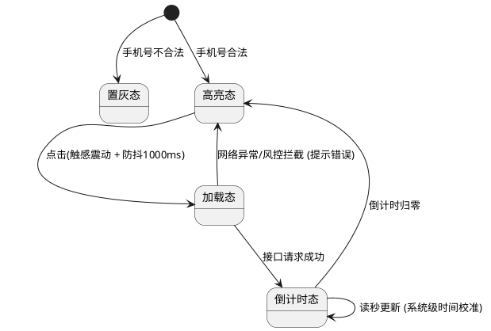

# PRD 撰写示例

以下示例展示使用本 skill 时的输入与期望输出格式。

---

## 示例 1: 获取验证码按钮

**用户输入：**
> 请帮我写一段"获取验证码按钮"的 PRD 规则。

**AI 应当输出：**

### 3.1 获取验证码按钮
- **位置**：登录表单内,验证码输入框右侧
- **目标**：下发短信验证码并防止恶意刷单

**按钮状态与交互**:
- 手机号不合法时,按钮置灰不可点击
- 手机号合法时,按钮变为蓝色可点击
- 点击后:
  - 触感震动(如适用)
  - 按钮显示加载动画,1秒内防止重复点击
  - 若发送失败,恢复可点击状态,顶部弹出红色提示:"发送失败,请检查网络后重试"
  - 若触发风控,弹窗提示:"当前请求存在安全风险,请稍后再试"
  - 发送成功后,开始60秒倒计时,按钮置灰显示"{N}s 后重发"
  - 倒计时归零后,恢复为"重新获取"可点击状态

**异常处理**:
- 弱网环境下,若8秒未响应,直接触发超时提示
- APP切后台或锁屏后,倒计时根据本地时间戳自动校准,不暂停或重置

**文本规则**:
- 静态文案:"获取验证码"
- 倒计时文案:"{N}s 后重发"(N为剩余秒数)
- 按钮宽度固定,文本过长时等比缩小

### 4. 流程与状态图表 (PlantUML)
*(此处展示内嵌的 PlantUML 短信验证码发送状态转换图)*

### 5. 附录 (Appendix)
**获取验证码 - 状态机图**

---

## 示例 2: 异步导出功能(复杂交互)

### 3.1 证书列表导出
- **位置**：证书管理列表右上角
- **目标**：支持大批量数据异步导出,避免超时

**筛选查询**:
- 学生姓名:模糊搜索,最多20字符,回车或点击"查询"触发
- 身份证号:精确匹配,仅允许数字和字母X,失焦时校验长度(6位或18位)

**列表展示**:
- 默认按生成时间倒序,每页20条
- 无数据时显示空状态插画:"暂无符合条件的证书记录"
- 手机号脱敏:138****8888(保留前3后4)
- 渠道信息:最大宽度150px,超出截断显示"...",悬停显示完整内容

**证书状态映射**:
| 后台状态 | 显示文案 | 图标 | 颜色 |
|---------|---------|------|------|
| 批改中 | "批改中" | 旋转圈 | 橙色 |
| 待复核 | "证书复核中" | 双对勾 | 蓝色 |
| 制作中 | "证书制作中" | 打印机 | 靛青色 |
| 已寄送 | "证书已寄送" | 包裹 | 绿色 |

**导出按钮交互**:
- 默认:蓝色"导出数据"按钮
- 点击前校验:无数据时提示"当前无数据可导出"
- 导出中:
  - 按钮变为"正在导出...",显示加载动画,禁用状态
  - 顶部提示:"正在导出,请稍后在「消息中心」查看并下载"(3秒后消失)
- 导出完成:
  - 若用户未离开页面:按钮变为绿色"下载文件",点击直接下载
  - 若用户已离开:按钮恢复默认,需去消息中心查看

---

## 示例 3: 测试用例配置弹窗(表单联动)

### 3.1 编程题测试用例弹窗
- **位置**：题目详情页 -> 评分标准 -> "添加测试用例"
- **目标**：配置自动判分规则

**表单字段**:
- 用例名称:必填文本
- 权重值:必填正整数,失焦时校验,非正整数则清空并提示
- 得分占比:只读,实时显示当前权重占总权重的百分比
- 用例类型:必选,两个选项
  - "用例检查":显示"运行输入"和"运行输出"(均必填)
  - "正则匹配":显示"正则表达式"、"包含"、"不包含"、"匹配方式"(至少填一项)

**保存交互**:
- 点击"保存":校验必填项,通过后关闭弹窗并刷新列表
- 点击"取消"或右上角X:直接关闭,不保存

---

## 示例 4: 车辆详情页(数据对比展示)

### 3.1 ECU配置对比
- **位置**：车辆详情 -> ECU信息标签页
- **目标**：对比云端配置与车端实际数据

**数据展示规则**:
- 数据一致:正常显示单行文本
- 数据冲突:分两行显示
  - 第一行:"云端:{系统值}"
  - 第二行:"车端:{实际值}"(红色高亮)
- 仅云端有数据:显示系统值 + 灰色备注"(车端无数据)"
- 仅车端有数据:显示车端值 + 灰色备注"(云端无数据)"
- 两端均无:显示灰色"无数据"

**远程控制**:
- 默认:"选择操作"下拉框 + 禁用的"推送"按钮
- 选择操作后:"推送"按钮亮起
- 点击推送:按钮变为加载状态,禁用
- 推送完成:历史记录顶部新增一条,状态根据车端响应动态更新(已发送/成功/超时/失败)
